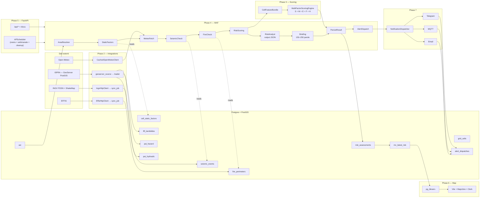

# Architettura

> §3.2 del documento di progetto. Questo file è l'unica fonte di verità
> per la *forma del sistema* — i singoli sottosistemi sono documentati
> accanto al loro codice (es. `src/limen/core/scoring/` per il motore di
> scoring).

## Obiettivi

1. **Deploy indipendente dal motore**: codice identico su Postgres+PostGIS
   in Docker locale, Neon serverless (solo dev/test) e VPS self-hosted.
   Cambiano solo `DB__CONNECTION_STRING`, `OBJECT_STORE__*` e le chiavi LLM
   per ambiente.
2. **Scoring puro**: il motore deterministico V1 è una *funzione* di un
   `CellFeatureBundle`. Niente DB, niente rete, niente LLM. Il motore ML
   V2 si inserisce nello stesso slot.
3. **Degradazione controllata**: qualsiasi sorgente esterna può fallire
   senza mandare in crash il workflow (Open-Meteo down ⇒ input neutri;
   ShakeMap INGV assente ⇒ lo score userà la GMPE in seguito; ISPRA 5xx ⇒
   log `integration.degraded` + il workflow prosegue).
4. **LLM non autoritativo**: i ChatAgent si limitano a riformulare il
   breakdown numerico. Lo score è fissato dal motore.

## Diagramma di alto livello

## Copertura

Copertura **nazionale**: tutte le 20 regioni ISTAT, griglia 1 km², ~312k
celle. La pipeline è stata validata sul pilota **Puglia + Basilicata** ed
è ora estesa all'intero territorio nazionale.

## Responsabilità dei layer

| Layer | Responsabilità | Dove |
|---|---|---|
| **Data** | asyncpg + codec PostGIS, migrazioni idempotenti, ObjectStore (filesystem / S3-compatibile) | `src/limen/data/` |
| **Integrations** | client HTTP Open-Meteo / INGV / EFFIS + loader ISPRA da GeoServer PostGIS, tutti con retry tenacity + degradazione controllata | `src/limen/integrations/` |
| **Scoring** | motore deterministico puro §2.4; guidato da YAML, nessun magic number | `src/limen/core/scoring/` |
| **Agents** | executor MAF-shaped + ChatAgent + resolver della LLM factory | `src/limen/agents/` |
| **Notifications** | Protocol NotificationChannel + Telegram/MQTT/Email + dispatcher | `src/limen/notifications/` |
| **API** | app FastAPI, DI tipizzata via Depends(), job periodici APScheduler | `src/limen/api/` |
| **Observability** | instrumentor di tracing OpenTelemetry + strumenti di metrica custom | `src/limen/observability/` |
| **Frontend** | mappa pubblica Vite + React + MapLibre, con auth Clerk | `frontend/` |

## Sorgente dati ISPRA

I dati statici ISPRA sono letti dal **PostGIS di GeoServer**
(`mcp-geoserver`) tramite il loader `integrations/geoserver_source`:

* **IFFI** — frane, aree in frana, DGPV → `iffi_landslides`.
* **Mosaico PAI frana** (pericolosità da frana) → `pai_hazard`.
* **Mosaico idraulica** (pericolosità idraulica) → `pai_hydraulic`.

Il componente **H** (idraulico) del motore di scoring è ora **attivo**,
alimentato dal mosaico idraulica ISPRA.

## Backtest (§2.5)

* **Truth set**: catalogo di eventi datati **e-ITALICA**.
* **Pioggia antecedente**: **CERRA** (~5.5 km) via Open-Meteo (non ERA5).
* **Soglia Caine**: ri-tarata su e-ITALICA.

## LLM

Il resolver salta i provider cloud in assenza di SDK e ripiega su
**Ollama** (host Ollama + modello **qwen**). L'ordine di precedenza resta
`LLM__PROVIDER` > `ANTHROPIC_API_KEY` > `OPENAI_API_KEY` > Foundry >
Ollama.

## Invarianti trasversali

Sono intenzionalmente ripetute in CLAUDE.md affinché i futuri contributori
non possano ignorarle.

* **Niente ORM.** SQL puro via asyncpg + codec PostGIS.
* **Le migrazioni sono immutabili una volta applicate** (tracciate con
  checksum).
* **Niente `print`** — `structlog.get_logger(__name__)` ovunque.
* **Tutte le costanti di scoring** vivono in `regional_thresholds.yaml`.
* **Gli endpoint non contengono business logic** — chiamano workflow /
  repo.
* **APScheduler** in-process, così lo stesso code path funziona su Neon.
* **Il frontend è Vite, non Next.js** — mappa pubblica read-only; l'auth
  Clerk è attiva via `@clerk/react` sulla stessa SPA Vite.
* **I canali non possono mai far crashare il workflow** — ogni invio è
  avvolto in `_send_safe` nel dispatcher.

## Deploy

Target: **VPS self-hosted + Docker**, nessun cloud provider. Neon resta
valido solo per branch di dev/test. Comandi:

* `make up` — avvia lo stack.
* `make init` — pipeline completa: migrate → seed 20 regioni →
  ingest-events → bootstrap → calibrate.

## Documenti correlati

* [`data-model.md`](./data-model.md) — schema PostGIS.
* [`scoring-model.md`](./scoring-model.md) — equazioni §2.4 + chiavi YAML.
* [`api.md`](./api.md) — endpoint + payload.
* [`runbook.md`](./runbook.md) — operations + incidenti.
* [`deployment.md`](./deployment.md) — Neon dev/test, VPS self-hosted + Docker.
