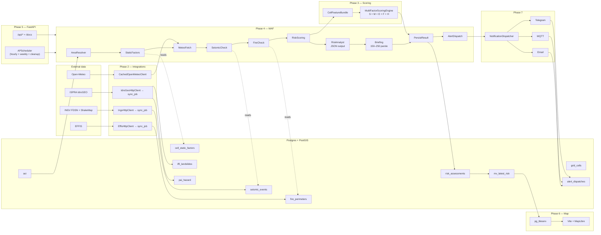

# Architecture

> §3.2 of the project doc. This file is the single source of truth for
> the *system shape* — individual subsystems are documented next to
> their code (e.g. `src/limen/core/scoring/` for the scoring engine).

## Goals

1. **Engine-agnostic deployment**: identical code on local Docker
   Postgres+PostGIS, Neon serverless, and Aruba VPS. Only
   `DB__CONNECTION_STRING`, `OBJECT_STORE__*` and LLM keys change per
   environment.
2. **Pure scoring**: the deterministic V1 engine is a *function* of a
   `CellFeatureBundle`. No DB, no network, no LLM. The V2 ML engine
   will drop into the same slot.
3. **Graceful degradation**: any external source can fail without
   crashing the workflow (Open-Meteo down ⇒ neutral inputs; INGV
   ShakeMap absent ⇒ score uses GMPE later; ISPRA WFS 5xx ⇒
   `integration.degraded` log + workflow proceeds).
4. **LLM non-authoritative**: ChatAgents only reformulate the numeric
   breakdown. The score is fixed by the engine.

## High-level diagram

## Layer responsibilities

| Layer | Responsibility | Where |
|---|---|---|
| **Data** | asyncpg + PostGIS codec, idempotent migrations, ObjectStore (filesystem / S3-compatible) | `src/limen/data/` |
| **Integrations** | Open-Meteo / ISPRA / INGV / EFFIS HTTP clients, all with tenacity retry + graceful degradation | `src/limen/integrations/` |
| **Scoring** | Pure §2.4 deterministic engine; YAML-driven, no magic numbers | `src/limen/core/scoring/` |
| **Agents** | MAF-shaped executors + ChatAgents + LLM factory resolver | `src/limen/agents/` |
| **Notifications** | NotificationChannel Protocol + Telegram/MQTT/Email + dispatcher | `src/limen/notifications/` |
| **API** | FastAPI app, typed Depends() DI, APScheduler periodic jobs | `src/limen/api/` |
| **Observability** | OpenTelemetry tracing instrumentors + custom metric instruments | `src/limen/observability/` |
| **Frontend** | Vite + React + MapLibre public read-only map | `frontend/` |

## Cross-cutting invariants

These are intentionally repeated in CLAUDE.md so future contributors
can't miss them.

* **No ORM.** Plain SQL via asyncpg + PostGIS codec.
* **Migrations are immutable once applied** (checksum-tracked).
* **No `print`** — `structlog.get_logger(__name__)` everywhere.
* **All scoring constants** live in `regional_thresholds.yaml`.
* **Endpoints contain no business logic** — they call workflows /
  repos.
* **APScheduler** in-process so the same code path works on Neon.
* **Frontend is Vite, not Next.js** — public read-only map; Clerk
  auth (deferred) will plug in via `@clerk/clerk-react`.
* **Channels can never crash the workflow** — every send is wrapped in
  `_send_safe` in the dispatcher.

## Related docs

* [`data-model.md`](./data-model.md) — PostGIS schema.
* [`scoring-model.md`](./scoring-model.md) — §2.4 equations + YAML keys.
* [`api.md`](./api.md) — endpoints + payloads.
* [`runbook.md`](./runbook.md) — operations + incidents.
* [`deployment.md`](./deployment.md) — Neon dev/test, Aruba demo+prod, Azure.
