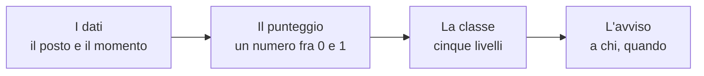
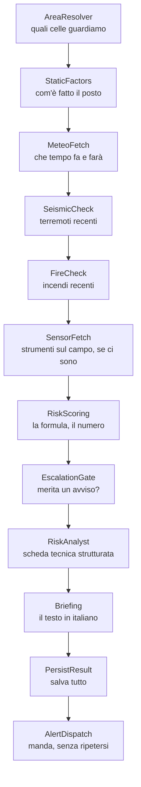

# Cosa fanno ML e AI, e cosa no

**Nessuna intelligenza artificiale decide il colore della tua cella.** Il
colore lo decide la formula della pagina precedente, che è scritta, leggibile
e ricalcolabile a mano. L'apprendimento automatico gira accanto e viene
misurato, ma non comanda; il modello linguistico scrive le frasi, e non può
toccare i numeri. Questa pagina spiega chi fa cosa, e soprattutto come
facciamo a sapere se il sistema funziona — comprese le volte in cui non
funziona.

<!-- schema-fase: punteggio -->

Vale qui come altrove: Limen affianca e non sostituisce l'allertamento
ufficiale, e nessun suo avviso ha valore legale.

## Il motore che decide è il più semplice dei tre, ed è voluto

Il punteggio operativo — quello salvato nello storico, quello che colora la
mappa, quello che fa partire un avviso — viene sempre dal **motore
deterministico**: la somma pesata descritta nella
[pagina 2](./02-come-si-calcola-il-rischio.md).

"Deterministico" vuol dire che a parità di ingredienti restituisce sempre lo
stesso numero, ovunque venga eseguito, oggi e fra tre anni. Non impara, non
si adatta, non cambia idea da solo. Sembra un limite. È il motivo per cui è
lui a comandare:

- **Si può ricostruire a mano.** Se domani un tecnico comunale contesta un
  avviso, la risposta non è "il modello ha deciso così": è un foglio con sei
  numeri e cinque moltiplicazioni. L'abbiamo fatto nell'esempio della pagina
  precedente, e chiunque può rifarlo.
- **Non può degradare in silenzio.** Un modello statistico addestrato su dati
  vecchi peggiora man mano che il mondo cambia, e lo fa senza accorgersene.
  Una formula scritta fa sempre quello che c'è scritto.
- **Si corregge dove serve.** Se la soglia di pioggia del sud è sbagliata, si
  cambia un numero in un file e si sa esattamente cosa cambierà. In un
  modello addestrato, la stessa correzione richiede di riaddestrare tutto e
  sperare.

Nel progetto questa regola ha un nome — il motore V1 è il **campione** — ed è
una regola scritta: nessun modello lo sostituisce finché non lo batte su una
misura onesta, e la sostituzione resta comunque un comando che una persona
digita.

## Lo sfidante: un modello che guarda e tace

Accanto al campione gira un **modello di apprendimento automatico**
(*machine learning*: un programma che ricava le regole dagli esempi invece
di riceverle scritte). Nel gergo del progetto è lo **sfidante**, e la
modalità in cui gira si chiama **shadow**, ombra: vede gli stessi dati,
calcola la sua probabilità per ogni cella, la scrive in una tabella a parte —
e finisce lì. Non colora niente, non manda niente.

**Cosa ha imparato.** È stato addestrato su circa **37.000 campioni**
costruiti dal catalogo e-ITALICA (le frane italiane datate) accoppiati con la
pioggia realmente caduta prima di ognuna, ricostruita dall'archivio
meteorologico europeo CERRA. Per ogni campione sa cos'era il posto, cos'era
successo nei giorni prima, e se la frana c'è stata.

**Quanto è bravo.** La misura si chiama AUC-PR, e vale **0,60 per il modello
contro 0,28 per il motore deterministico**, sulla stessa partizione
territoriale e con la stessa pioggia. Tradotta: se ordini tutte le
celle-giorno dalla più sospetta alla meno sospetta e scendi lungo la lista,
il modello mantiene una quota di segnalazioni azzeccate circa **doppia**
rispetto alla formula. Detto in modo ancora più diretto: dove la formula
manda quattro allarmi per trovare una frana, il modello ne manda meno di due.

**E allora perché non comanda?** Per tre ragioni, in ordine di importanza.

La prima è che quel numero, per quanto onesto, è stato ottenuto su una
partizione di prova, mentre il criterio che il progetto si è dato per
promuovere un modello è più severo: deve battere la baseline **e** superare
soglie assolute su quante frane trova, quanti falsi allarmi produce, con
quanto anticipo, e quanto sono ben calibrate le sue probabilità. Il criterio
è scritto nel codice, non negoziabile a posteriori.

La seconda è che anche superando tutto, **la promozione resta una decisione
umana**: il sistema può contrassegnare un modello come idoneo, ma metterlo in
produzione è un comando che un operatore digita. Non esiste nessun percorso
per cui un modello si promuove da solo durante la notte.

La terza è che un modello che sbaglia è molto più difficile da smontare di
una formula che sbaglia, e questo in un contesto di protezione civile pesa.

**Come è stato addestrato, perché conta.** Il tranello classico di questi
modelli è la *fuga di informazione*: se alleni il modello su celle e lo
verifichi su celle vicine, lui riconosce il posto invece di imparare il
fenomeno, e i numeri risultano splendidi e falsi. Qui la divisione fra dati
di allenamento e dati di verifica è fatta **a blocchi geografici**: interi
riquadri di territorio finiscono o di qua o di là, mai a cavallo. È più
severo di quanto si usi di solito, e i numeri che ne escono sono più bassi e
più veri.

Lo sfidante gira **una volta per notte**, non a ogni ciclo orario. Il motivo è
prosaico: calcolare un modello di questo tipo, con la sua spiegazione
dettagliata, su trecentomila celle ogni ora costa più di quanto valga un
verdetto che per ora dice "non promuovibile". La notte misura, il giorno
opera.

Esiste anche uno sfidante per gli **incendi**, addestrato su una stagione
(30.066 campioni): AUC-PR **0,352** contro **0,237** della baseline. Stesso
trattamento: gira, viene misurato, non comanda.

## Gli agenti: una squadra, non un cervello

La parola "agente" oggi evoca un assistente con cui si chatta. Qui significa
un'altra cosa, più vicina al senso comune di "addetto": un pezzo di programma
con **un compito solo**, che riceve il lavoro da chi lo precede e lo passa a
chi lo segue. Il ciclo orario è una catena di montaggio con dodici postazioni:

Tradotti uno per uno:

- **AreaResolver** decide di quali celle ci si occupa in questo giro.
- **StaticFactors** recupera i numeri del posto, già calcolati una volta per
  tutte.
- **MeteoFetch** scarica pioggia, umidità del suolo e neve, e tiene una copia
  in memoria per mezz'ora — chiamare cento volte lo stesso servizio per la
  stessa cella sarebbe maleducazione oltre che lentezza.
- **SeismicCheck** interroga il catalogo dei terremoti dell'INGV.
- **FireCheck** cerca perimetri di incendio recenti che intersecano l'area.
- **SensorFetch** raccoglie le letture degli strumenti in campo, dove ci sono.
- **RiskScoring** applica la formula. È l'unico che produce il punteggio, ed
  è una funzione pura: niente rete, niente database, niente AI.
- **EscalationGate** decide se il risultato merita un avviso, applicando la
  soglia e le regole di esposizione (una cella con una strada e delle case
  pesa più di una cella di bosco).
- **RiskAnalyst** è il primo dei due passaggi di intelligenza artificiale, e
  produce una scheda **strutturata**: causa principale, livello di fiducia,
  elementi esposti. Non prosa libera: campi predefiniti con valori ammessi.
- **Briefing** è il secondo, e scrive il paragrafo in italiano che leggi nella
  scheda della cella.
- **PersistResult** salva punteggi e motivazioni nello storico.
- **AlertDispatch** manda gli avvisi sui canali configurati, controllando
  prima di non aver già avvisato per la stessa cella di recente.

**Niente chat, e non per pudore.** L'intelligenza artificiale in questa
catena serve a *spiegare* e, insieme al ciclo previsionale, a *anticipare*.
Non c'è un'interfaccia conversazionale perché non c'è niente da chiedere che
la mappa e il dettaglio della cella non dicano già, e perché una risposta
conversazionale a una domanda su un rischio è precisamente il posto dove un
modello linguistico può inventare con la massima sicurezza di sé.

**La regola che protegge i numeri.** I due passaggi AI ricevono il punteggio
già calcolato e possono solo aggiungere testo. Non possono modificare né il
valore né la classe né i fattori. Non è una promessa: è un test automatico
che gira a ogni modifica del codice e che fallisce, bloccando tutto, se il
testo generato riesce a spostare di un millesimo un numero. Se il modello
linguistico non risponde, o è spento, o è lento, gli avvisi partono lo stesso
con il testo deterministico.

E un dettaglio che dice molto su quanto pesa la parte AI: su un ciclo
misurato di 156 secondi per diecimila celle, la formula ha impiegato
**0,88 secondi** e i due passaggi di scrittura **140 secondi**. Per questo il
testo narrativo è stato spostato fuori dal ciclo orario e viene scritto dopo,
sulle righe già salvate: la mappa mostra la spiegazione deterministica finché
quella scritta non arriva.

## Guardare avanti: la previsione a 48 ore

Lo stesso motore, con la stessa formula, gira periodicamente usando la
pioggia **prevista** al posto di quella caduta, con orizzonte tipico di
**48 ore**. Se una cella supera la soglia in quello scenario, parte un avviso
etichettato **PREVISIONE**, con una tracciatura separata da quella degli
avvisi operativi.

Non è una previsione di frana ed è importante ripeterlo: è il punteggio che
la cella avrebbe se la pioggia prevista cadesse come previsto. L'incertezza
della previsione meteo si somma a tutte le altre.

## Come sappiamo se funziona: il backtest

L'unico modo onesto di valutare un sistema di allerta è **rigiocare il
passato**: prendere una finestra storica, far finta di non sapere cosa è
successo, far girare il sistema giorno per giorno e confrontare i suoi avvisi
con gli eventi realmente avvenuti. Si chiama *backtest*, e ne escono tre
numeri.

**Quante frane ha anticipato** (in gergo *hit rate*): su cento frane
realmente avvenute, quante erano in una cella che il sistema aveva già
segnalato. L'obiettivo che il progetto si è dato è **almeno il 70%**.

**Quanti allarmi sono caduti nel vuoto** (*FAR*): su cento segnalazioni,
quante non sono state seguite da niente. L'obiettivo è **non più del 30%**.

**Con quanto anticipo** (*lead time*): quante ore prima dell'evento la
segnalazione era già attiva. L'obiettivo è **almeno 18 ore** — il tempo utile
per fare qualcosa.

E qui arriva la parte che molti progetti non pubblicano.

### Le frane: la prima misura è un fallimento su tutta la linea

Il catalogo delle frane non era mai stato caricato su nessuna macchina in
esercizio, quindi il motore frane — il campione di produzione, quello
descritto in queste pagine — **non era mai stato misurato**. Caricato il
catalogo (6.312 frane datate fra il 1996 e il 2021) e rigiocata la finestra
più densa disponibile, la Liguria fra il 1° novembre e il 5 dicembre 2019, su
5.884 celle e 131 frane datate, il risultato è questo:

- frane anticipate: **7,6%** contro un obiettivo del 70%;
- allarmi caduti nel vuoto: **95,6%** contro un obiettivo del 30%;
- anticipo medio: **17,9 ore** contro un obiettivo di 18.

Dieci frane anticipate su centotrentuno. Il motore, in pratica, quasi non
allerta mai. Il perché è in parte già spiegato nella pagina precedente — la
classe alta è aritmeticamente difficile da raggiungere, e le soglie regionali
ricalibrate non vengono applicate perché la macroregione non viene mai
assegnata — e in parte è ancora aperto. Tutto è tracciato pubblicamente nella
issue #122 del progetto, con i comandi per riprodurre la misura.

Scriviamo questo numero nella documentazione divulgativa per la stessa
ragione per cui pubblichiamo la formula: un sistema di allerta che non
dichiara i propri fallimenti non è verificabile, ed è quindi inutile a chi
dovrebbe fidarsene.

### Alluvione e incendio: qui i numeri ci sono

Gli altri due pericoli **sono** stati misurati contro eventi reali, e si
comportano molto meglio.

**Alluvione**, Emilia-Romagna, rigiocando con le previsioni *come furono
emesse* e confrontando con i perimetri allagati osservati dai satelliti
europei: **77% di eventi anticipati**, con **50 ore di preavviso medio**.
Accanto a quel 77% va letto il **tasso di base**, cioè quanto spesso il
sistema segnala in generale: **7,3%**. Il rapporto fra i due — un fattore 10
— è la vera misura di quanto il sistema distingue, perché *un sistema che
segnala sempre ha il 100% di eventi anticipati e non distingue niente*. I
falsi allarmi restano alti, **79%**, e la ragione è dichiarata nella
configurazione stessa: dentro l'impronta di un'alluvione piove su tutti allo
stesso modo, e quel che decide chi finisce sott'acqua è dove scorre l'acqua,
non quanta ne cade su quel punto. Senza un dato sul deflusso, nessuna soglia
di pioggia può separare le celle allagate da quelle asciutte.

**Incendio**, Basilicata, contro i perimetri bruciati reali: **79% di eventi
anticipati contro un tasso di base del 43%** nella stagione 2025, e **100%
contro 28%** nel 2024.

### Perché i falsi allarmi sono difficili da interpretare

Un allarme "caduto nel vuoto" può essere di due tipi molto diversi: il
sistema ha segnalato dove non è successo niente, oppure il sistema ha
segnalato dove è successo qualcosa **che nessuno ha registrato**.

Per le frane il secondo caso è frequentissimo. Una frana in un bosco, che non
tocca strade né case, spesso non entra in nessun catalogo. Il tasso di falsi
allarmi misurato contro un catalogo incompleto è quindi *strutturalmente*
sovrastimato, e non c'è modo di sapere di quanto.

Per le alluvioni il progetto ha affrontato il problema in modo esplicito,
perché la soluzione esisteva: i satelliti europei pubblicano, insieme ai
perimetri allagati, anche le **maschere di osservazione**, cioè dove il
satellite ha effettivamente guardato. Dentro quella maschera, l'assenza di
allagamento è un "non allagato" verificato; fuori, un'allerta non è falsa —
è *non verificabile*. La differenza non è accademica: calcolato senza questa
distinzione, il tasso di falsi allarmi in Piemonte risultava del 100% con
diecimila avvisi contro dodici celle di verità, perché quella attivazione
satellitare aveva mappato 0,3 chilometri quadrati. Un numero del genere non
misura il modello: misura quanto ha guardato il satellite.

## Cosa manca, detto senza entusiasmo

**Incertezza dichiarata.** Oggi il punteggio è un numero secco. Dovrebbe
essere accompagnato da quanto il sistema è sicuro di quel numero: una cella
con dati completi e una con metà degli ingredienti mancanti non meritano la
stessa fiducia, e oggi si presentano identiche.

**Il terreno che si muove davvero.** Esistono misure satellitari europee
(EGMS) che dicono di quanti millimetri all'anno si sposta ogni punto del
territorio. È il segnale più diretto che esista di un versante che sta
cedendo lentamente, e sarebbe un ingrediente di qualità diversa da tutti
quelli descritti qui. L'integrazione è scritta ma il segnale non alimenta
ancora il punteggio.

**La verifica satellitare dopo l'evento.** Confrontare le immagini prima e
dopo un innesco permetterebbe di scoprire le frane che nessun catalogo
registra, e quindi di misurare i falsi allarmi per quello che sono davvero.

**Il radar come misura, non solo come sveglia.** La rete radar nazionale è
già collegata e serve da innesco: quando vede pioggia intensa su una regione,
quella regione viene ricalcolata subito invece di aspettare il turno. Ma la
sua misura di pioggia — un chilometro di risoluzione, cinque minuti di
aggiornamento — non entra ancora nel punteggio, dove continua a essere usata
la pioggia del modello meteo, molto più grossolana.

Nessuna di queste quattro cose è promessa per una data. Sono scritte qui
perché un elenco pubblico di quello che manca è l'unico modo per essere presi
sul serio su quello che c'è.
