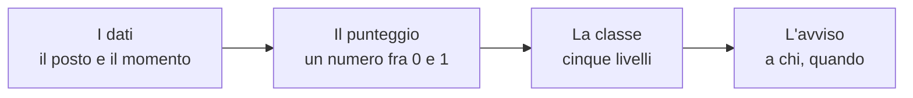

# Le fonti dati: tutte aperte, tutte a costo zero

**Ogni numero che Limen usa viene da un dato pubblico che tu hai già pagato
con le tasse, e che chiunque può scaricare senza chiedere il permesso e senza
pagare un abbonamento.** Non c'è un solo dato commerciale nel sistema, non
c'è una chiave d'accesso a pagamento, non c'è un fornitore che possa alzare
il prezzo o chiudere il rubinetto lasciando la piattaforma muta. Questa
pagina elenca le fonti una per una: chi le produce, cosa contengono, ogni
quanto le leggiamo, come diventano un numero per cella.

<!-- schema-fase: dati -->

Come sempre: Limen affianca e non sostituisce l'allertamento ufficiale, e
nessun suo avviso ha valore legale.

## Le frane già avvenute: l'inventario IFFI di ISPRA

Lo produce l'**Istituto Superiore per la Protezione e la Ricerca Ambientale**
insieme alle Regioni e alle Province autonome, ed è il censimento nazionale
dei fenomeni franosi italiani: dove, di che tipo, con quale estensione. È la
base di conoscenza più importante che il paese abbia su questo fenomeno.

Contiene i poligoni e i punti delle frane censite su tutto il territorio,
divisi per tipologia (frane puntuali, aree franose, deformazioni gravitative
profonde di versante).

Lo leggiamo **una volta all'avvio del sistema e poi con una sincronizzazione
settimanale**: un inventario non cambia da un'ora all'altra.

Diventa un numero per cella in due modi: contando quante frane cadono entro
500 metri dal bordo della cella (`iffi_density_500`) e misurando la distanza
dalla frana censita più vicina (`distance_to_iffi_m`). Il primo dei due è
l'ingrediente di maggior peso fra i fattori lenti.

Licenza **CC-BY 4.0**, portale <https://idrogeo.isprambiente.it/>.

## Le aree già perimetrate come pericolose: mosaicature PAI di ISPRA

Sempre ISPRA, che raccoglie e armonizza in un unico mosaico nazionale le
perimetrazioni prodotte dalle Autorità di bacino nei Piani di Assetto
Idrogeologico.

Contiene due mosaici distinti: le **aree a pericolosità da frana** e le
**aree a pericolosità idraulica**, entrambe classificate su una scala da
moderata a molto elevata.

Anche queste si leggono all'avvio e poi settimanalmente.

La pericolosità da frana diventa il fattore `pai_class_norm`, cioè la classe
riportata su una scala da 0 a 1. Quella idraulica alimenta la componente `H`
del punteggio frane e, soprattutto, è la base del pericolo alluvione: copre
circa **132.000 celle** italiane.

Licenza **CC-BY 4.0**, stesso portale IdroGeo.

## La verità storica: il catalogo e-ITALICA del CNR-IRPI

Lo produce l'**Istituto di Ricerca per la Protezione Idrogeologica del
Consiglio Nazionale delle Ricerche**, ed è la cosa che rende questo progetto
misurabile invece che opinabile.

Contiene le frane italiane **innescate da pioggia, datate**, con l'evento
piovoso ricostruito dai pluviometri: nella versione caricata, **6.312 frane
fra il 1996 e il 2021**, e **5.974 coppie intensità-durata** usate per
ritarare le soglie di pioggia.

Lo leggiamo **una volta sola**, scaricandolo automaticamente da un
identificativo permanente Zenodo fissato nel codice: così chiunque rifaccia
i conti fra due anni usa lo stesso identico catalogo.

Non diventa un numero per cella: diventa il **metro**. È la verità contro cui
si rigioca il passato per calcolare quante frane il sistema avrebbe
anticipato, ed è il materiale su cui è addestrato il modello sfidante.

Licenza **CC-BY 4.0**, identificativo permanente
<https://doi.org/10.5281/zenodo.14204473>.

## Il tempo che fa e che farà: Open-Meteo

È un servizio europeo che ridistribuisce, con un'interfaccia semplice e senza
registrazione, i dati dei principali modelli meteorologici pubblici — fra cui
quelli del Centro europeo per le previsioni a medio termine.

Ne prendiamo la pioggia oraria osservata e prevista, l'umidità del suolo a
due profondità (0–7 e 7–28 centimetri), la neve al suolo, e — da due
interfacce separate — la **portata dei fiumi** dal sistema europeo GloFAS e
l'altezza delle onde sotto costa.

Lo leggiamo **in continuo, a ogni ciclo orario**, con una copia locale che
dura mezz'ora per non ripetere la stessa domanda decine di volte.

Diventa quasi tutta la componente meteo: l'intensità e la durata dell'evento
piovoso per la soglia di Caine, la pioggia dei trenta giorni precedenti per
l'indice di pioggia antecedente, l'umidità del suolo per la curva a S.

Interfacce: <https://api.open-meteo.com/v1/forecast>,
<https://archive-api.open-meteo.com/v1/archive>,
<https://flood-api.open-meteo.com/v1/flood>. Uso gratuito per impieghi non
commerciali; licenza esatta: `TODO(verificare)` — il repository non la
registra.

## Il passato del tempo: gli archivi ERA5 e CERRA

Sono le **rianalisi** del programma europeo Copernicus: ricostruzioni
coerenti del tempo che ha fatto, ora per ora, per decenni all'indietro. CERRA
è quella specifica per l'Europa, con maglie di **5,5 chilometri**.

Contengono pioggia, temperatura, umidità e molto altro per ogni ora dagli
anni Ottanta a oggi.

Le leggiamo **solo quando si rigioca il passato**: non servono all'esercizio
quotidiano.

Diventano la pioggia dei backtest e dei campioni di addestramento del
modello. È un punto delicato e va detto: la pioggia con cui si verifica il
sistema *non è* quella con cui il sistema lavora ogni giorno, e su un
temporale localizzato le due possono differire parecchio.

Licenza: `TODO(verificare)` — il repository non la registra; i prodotti
Copernicus sono in genere riusabili con attribuzione.

## I terremoti: INGV

L'**Istituto Nazionale di Geofisica e Vulcanologia** pubblica il catalogo
degli eventi sismici italiani e, per gli eventi più forti, le mappe dello
scuotimento effettivamente stimato al suolo.

Prendiamo gli eventi di magnitudo pari o superiore a **3,5** degli ultimi
**sette giorni** dentro il riquadro dell'area monitorata, e la griglia di
scuotimento (ShakeMap) quando esiste.

Lo leggiamo **a ogni ciclo**, ed è una lettura veloce perché la finestra è
corta.

Diventa la componente `E`: per ogni evento si prende lo scuotimento al suolo,
lo si fa decadere col tempo trascorso, si tiene il massimo e lo si passa in
una curva a S.

Interfacce: <https://webservices.ingv.it/fdsnws/event/1/query> e
<https://shakemap.ingv.it/>. Licenza: `TODO(verificare)` — il repository non
la registra.

## Gli incendi, dopo: i perimetri EFFIS

Il **European Forest Fire Information System**, parte dei servizi di
emergenza di Copernicus, pubblica i perimetri delle aree bruciate rilevati da
satellite in tutta Europa.

Contiene la geometria di ogni incendio significativo con la sua data di
inizio: per la sola Basilicata, **515 perimetri dal 2012 a oggi**.

Lo leggiamo con un **ciclo settimanale**.

Diventa il conteggio dei mesi trascorsi dall'ultimo incendio che tocca
l'area, che è l'ingresso della campana post-incendio della componente `F`.

Vale la pena una nota, perché è costata a questo progetto un anno di dati
mancanti: il servizio **non richiede alcuna credenziale**. Per molto tempo si
era concluso il contrario, e la tabella degli incendi restava vuota; il
difetto era nel nostro programma, non in un accreditamento mancante. È il
genere di errore che si commette quando si dà per scontato che un dato
pubblico sia difficile da ottenere.

Servizio: <https://maps.effis.emergency.copernicus.eu/gwis>. Licenza:
`TODO(verificare)`.

## Gli incendi, durante: i punti caldi NASA FIRMS

La **NASA** pubblica, con poche ore di ritardo, i punti in cui i suoi
satelliti hanno rilevato una sorgente di calore anomala.

Contiene le singole rilevazioni con posizione, data, potenza radiativa e un
codice che distingue un incendio di vegetazione da un impianto industriale o
da un vulcano. Nell'archivio italiano: **391.987 rilevazioni**, che diventano
**224.156** eventi cella-giorno e una misura di frequenza del fuoco su
**65.771 celle**.

Lo leggiamo **a ciclo continuo** per l'uso in tempo reale, e una volta sola
per l'archivio storico.

Serve a due cose: accendere il fattore post-incendio in poche ore invece di
aspettare il perimetro ufficiale, e misurare quanto è stato intenso un
incendio attraverso la densità di energia rilasciata.

Anche qui una nota istruttiva: senza il filtro sul tipo di rilevazione, la
cella più "incendiata" d'Italia risultava essere l'acciaieria di Taranto, con
3.308 giorni di fuoco — perché un altoforno è una sorgente di calore molto
affidabile.

Servizio: <https://firms.modaps.eosdis.nasa.gov/>. Licenza:
`TODO(verificare)`.

## Le alluvioni realmente avvenute: Copernicus EMS

Il **servizio europeo di gestione delle emergenze** attiva la mappatura
rapida da satellite quando un paese la richiede, e pubblica i perimetri di
quello che il satellite ha visto.

Contiene, per l'Italia, **13 attivazioni, 9.463 poligoni, 480 chilometri
quadrati allagati su 2.354 celle in 9 regioni** — e, insieme, le maschere di
osservazione che dicono dove il satellite ha guardato.

Lo leggiamo **una volta**, e lo teniamo in cache.

È il metro del pericolo alluvione, esattamente come e-ITALICA lo è per le
frane. Le maschere di osservazione sono ciò che permette di distinguere un
falso allarme da un'allerta semplicemente non verificabile.

Licenza: **© Unione Europea, Copernicus EMS — libero uso con attribuzione**,
nessuna credenziale richiesta. Servizio:
<https://rapidmapping.emergency.copernicus.eu/>.

## La pioggia vista dal radar: Protezione Civile

Il **Dipartimento della Protezione Civile** pubblica il mosaico della rete
radar nazionale con una risoluzione di **un chilometro e un aggiornamento
ogni cinque minuti**.

Contiene la stima istantanea dell'intensità di pioggia su tutta Italia.

Lo leggiamo **ogni pochi minuti**.

Oggi non entra nel punteggio: fa da **sveglia**. Quando il radar vede pioggia
oltre una soglia di intensità su una regione, quella regione viene
ricalcolata immediatamente invece di aspettare il turno orario. Portarlo
dentro il calcolo come misura di pioggia è una delle cose che mancano.

Licenza **CC-BY-SA 4.0**, servizio <https://radar-api.protezionecivile.it>.

## La forma del terreno: il modello digitale TINITALY

Il modello digitale del terreno nazionale prodotto dall'**INGV**, alla base
di ogni calcolo di pendenza.

Contiene la quota del suolo su una griglia regolare fitta.

Lo leggiamo **una volta sola**, in fase di preparazione dei dati.

Diventa la pendenza media della cella (`slope_deg`), e in prospettiva
l'esposizione del versante, la curvatura e l'indice di umidità topografica.

Licenza: `TODO(verificare)`.

## Il tipo di roccia: Carta Geologica ISPRA

La cartografia geologica nazionale in scala 1:500.000, sempre di ISPRA.

Contiene i poligoni delle unità litologiche e le faglie principali.

Lettura **una volta sola**.

Diventa il peso litologico della cella: per ogni cella si prende la classe
dominante per area e la si traduce in un numero tramite una tabella di
conversione esplicita, leggibile nel codice.

Licenza: `TODO(verificare)`.

## La copertura del suolo: CORINE Land Cover

Prodotto dal programma **Copernicus Land Monitoring Service**, è la mappa
europea di cosa c'è sul terreno: bosco, seminativo, tessuto urbano,
vigneto, roccia nuda.

Contiene la classificazione su pixel da 100 metri.

Lettura **una volta sola**.

Diventa due cose: il tipo di combustibile per il pericolo incendio, e il
riconoscimento del tessuto urbano per calcolare l'esposizione — cioè quanto
vale allertare per una cella, che non dipende solo da quanto è pericolosa ma
anche da chi e cosa c'è dentro.

Licenza: `TODO(verificare)`; catalogo
<https://land.copernicus.eu/>.

## Il suolo impermeabilizzato: Imperviousness Density

Sempre Copernicus Land, è la quota di superficie sigillata (asfalto, cemento,
tetti) di ogni punto del territorio.

Diventa un solo numero per cella, che **amplifica esclusivamente il ramo
pluviale del pericolo alluvione**: il cemento non fa crescere un fiume, fa
scorrere in superficie la stessa pioggia che altrove si infiltrerebbe. È il
meccanismo dell'allagamento urbano improvviso.

Lettura una volta sola. Licenza: `TODO(verificare)`.

## Strade, ferrovie, edifici: OpenStreetMap

La mappa collaborativa mondiale, costruita da volontari.

Contiene la rete stradale e ferroviaria con un dettaglio che nessun dato
ufficiale italiano eguaglia in copertura omogenea.

Lettura **una volta sola**.

Diventa le distanze dalla strada e dalla ferrovia più vicine, che entrano nel
calcolo dell'esposizione: una cella con una strada principale a duecento
metri pesa più di una cella isolata a parità di pericolosità.

Licenza **ODbL — dati © contributori OpenStreetMap**.

## I confini amministrativi: ISTAT

L'**Istituto Nazionale di Statistica** pubblica i confini ufficiali di
regioni, province e comuni.

Contiene le geometrie e i codici identificativi ufficiali.

Lettura **una volta sola**.

Diventano il modo in cui la mappa parla la lingua delle persone: il punteggio
è calcolato per cella, ma la classifica che leggi è per **comune**, perché
nessuno sa dire a memoria in che cella abita.

Licenza: `TODO(verificare)`; portale <https://www.istat.it/>.

## Il movimento del terreno: EGMS

Il **European Ground Motion Service** di Copernicus misura da satellite lo
spostamento millimetrico del suolo su tutta Europa.

È già collegato al sistema ma **non alimenta ancora il punteggio**: lo
elenchiamo qui per completezza e perché è, potenzialmente, l'ingrediente più
interessante di tutti — un versante che scende di qualche millimetro all'anno
lo dice prima di cedere.

Aggiornamento annuale. Licenza: `TODO(verificare)`.

## Il punto, per intero

Nessuna di queste fonti richiede un contratto. Nessuna richiede una carta di
credito. Le poche che richiedono una chiave d'accesso gratuita — i punti caldi
NASA in tempo reale — sono strutturate perché il sistema funzioni lo stesso
quando la chiave non c'è: la funzione resta spenta, nulla si rompe.

Questo ha tre conseguenze che vale la pena enunciare per esteso.

**Non c'è nessun vincolo con un fornitore.** Se domani un servizio chiudesse,
si sostituisce la sua parte senza che il resto del sistema se ne accorga:
ogni fonte esterna è dietro un'interfaccia, e una fonte che non risponde
restituisce "non lo so" invece di far cadere tutto. Lo stesso vale
all'incontrario: una amministrazione che volesse sostituire una fonte
nazionale con un proprio dato locale, più preciso, può farlo.

**Il costo di esercizio è quello del server.** Non c'è un costo per cella
monitorata, né per avviso inviato, né per utente. Un Comune che volesse
ospitare Limen per il proprio territorio pagherebbe la macchina e nient'altro
— e la [pagina 5](./05-ai-che-gira-in-casa.md) spiega perché anche la parte di
intelligenza artificiale rispetta questa regola.

**Chiunque può rifare tutto.** Non c'è un pezzo di questo sistema che dipenda
da un dato che solo noi possiamo vedere. Un gruppo di ricerca, una regione,
un'associazione può prendere il codice, scaricare gli stessi dati e ottenere
gli stessi numeri — o dimostrare che sono sbagliati, che è ancora più utile.
La [pagina 6](./06-trasparenza-e-riproducibilita.md) spiega come.

Questi dati, in fondo, li abbiamo già pagati tutti.
