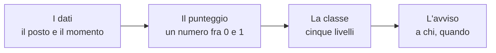

# Limen, spiegato a chi non fa questo mestiere

Questa cartella è la documentazione divulgativa di Limen: sei pagine e un
glossario che raccontano, senza chiedere competenze tecniche, **come viene
calcolato il rischio di frana, alluvione e incendio** per ogni chilometro
quadrato di territorio italiano, cosa fanno davvero il modello matematico e
l'intelligenza artificiale, da dove arrivano i dati e perché non costano
nulla.

Prima di tutto il resto, la cosa più importante:

> **Limen non sostituisce la Protezione Civile.** Gli avvisi ufficiali —
> quelli che fanno chiudere una scuola o evacuare una via — li emette il
> sistema di allertamento nazionale e regionale. Limen è uno strumento in
> più, aperto e ispezionabile: **nessun suo avviso ha valore legale**.

## Le pagine, in ordine di lettura

1. **[Limen in una pagina](./01-limen-in-una-pagina.md)** — cos'è, a chi
   serve, cosa fa quando piove forte, cosa non è. Se leggi una sola pagina,
   leggi questa.
2. **[Come si calcola il rischio della tua cella](./02-come-si-calcola-il-rischio.md)**
   — il calcolo per intero: cosa pesa il posto, cosa pesa il momento, come si
   sommano, come diventano cinque classi di colore. Con un esempio numerico
   seguito passo per passo.
3. **[Cosa fanno ML e AI, e cosa no](./03-cosa-fanno-ml-e-ai.md)** — il motore
   deterministico che decide, il modello di apprendimento automatico che per
   ora guarda e basta, gli agenti che si passano il lavoro, e come misuriamo
   se il sistema funziona (compresi i casi in cui non funziona).
4. **[Le fonti dati: tutte aperte, tutte a costo zero](./04-fonti-dati-open.md)**
   — chi produce ogni dato, cosa contiene, ogni quanto lo leggiamo, come
   diventa un numero per cella, con quale licenza.
5. **[L'intelligenza artificiale gira in casa](./05-ai-che-gira-in-casa.md)** —
   perché il modello linguistico sta su un server nostro e non in un servizio
   a consumo, cosa scrive e cosa non gli è permesso toccare.
6. **[Trasparenza e riproducibilità](./06-trasparenza-e-riproducibilita.md)** —
   licenza, come rifare tutto da zero, come verificare un singolo punteggio,
   come segnalarci un errore.

E il **[glossario](./glossario.md)**, per ogni parola che in queste pagine
compare senza essere ovvia.

## Lo schema che torna in ogni pagina

Ogni pagina racconta un pezzo della stessa catena, e lo dichiara in apertura
evidenziando il pezzo di cui parla:

<!-- schema-fase: tutte -->

## Una promessa sui numeri

Ogni cifra che leggi in queste pagine è presa dal codice o dai report di
misura di questo repository, e sotto ogni cifra c'è scritto dove andarla a
controllare. Dove una cifra non era verificabile, sta scritto
`TODO(verificare)` invece di un numero inventato: preferiamo un buco
dichiarato a una precisione finta.

Le stesse pagine sono leggibili nell'applicazione web alla voce
**Documentazione** (`#/documentazione`): sono gli stessi file, renderizzati.
