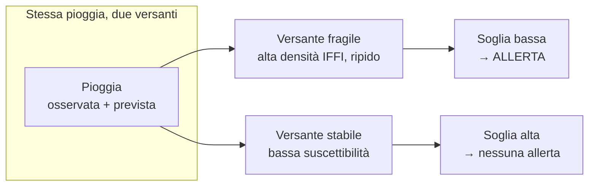
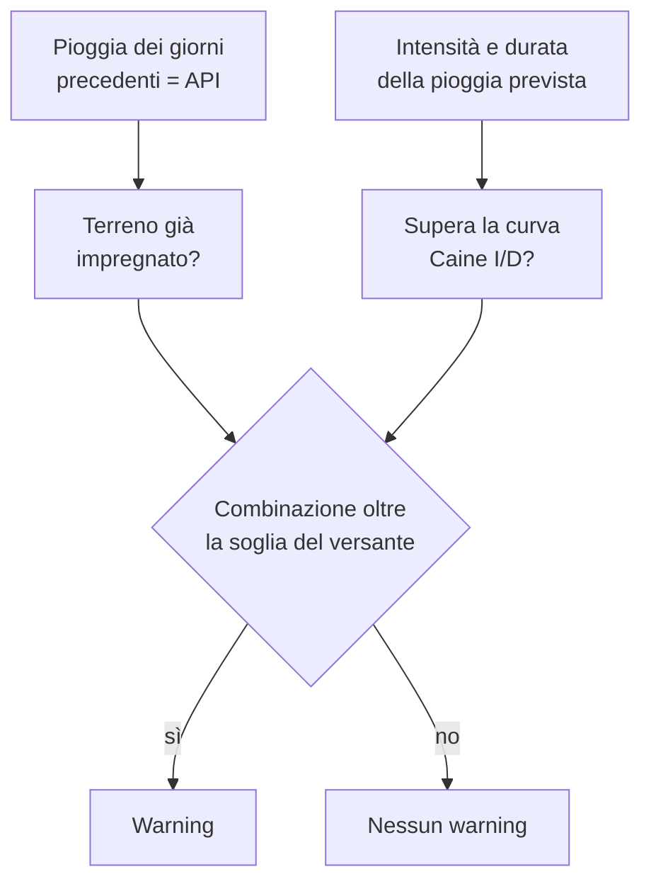
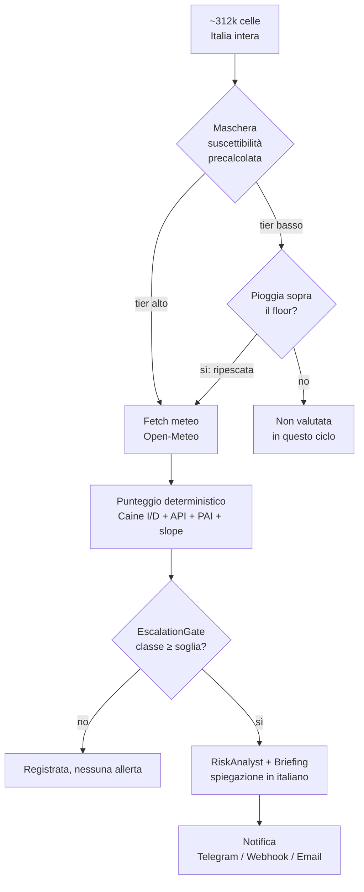

# Come si innesca un'allerta frana in Limen

> Questa pagina spiega **come nasce un'allerta** — il passaggio da dato grezzo a
> warning — con linguaggio tecnico ma leggibile senza aprire il codice. È il
> complemento della pagina divulgativa [«Come funziona»](../frontend) del
> frontend (`#/come-funziona`), che include un simulatore interattivo sulla
> formula reale. Qui si racconta la *logica di innesco*; lì si gioca con i numeri.
>
> Coerenza numerica e terminologica verificata contro
> [`docs/scoring-model.md`](./scoring-model.md): ogni valore citato qui è
> tracciabile lì o nel file dei parametri `regional_thresholds.yaml`.

## 1. L'idea in una frase

Una frana da pioggia scatta quando **l'acqua già accumulata nel terreno più
l'intensità della pioggia in arrivo superano la soglia di *quel* versante**. Non
esiste una soglia unica valida ovunque: ogni versante ha la sua, e Limen la
calcola combinando quanto quel punto è fragile con quanta acqua sta ricevendo.

## 2. I due strati: il «dove» e il «quando»

Limen ragiona su due famiglie di dati:

- **Il «dove» — suscettibilità (statica).** Quanto un punto è predisposto a
  franare, indipendentemente dal meteo di oggi: morfologia, geologia, pendenza,
  storia delle frane passate, pericolosità idrogeologica. Cambia molto lentamente,
  quindi si precalcola una volta e si riusa.
- **Il «quando» — meteo (dinamico).** Le condizioni del momento: pioggia
  osservata nelle ore/giorni scorsi, pioggia prevista, umidità del suolo. Si
  aggiorna a ogni ciclo di monitoraggio.

> **Glossario minimo** (una riga ciascuno)
> - **Suscettibilità** — quanto un versante è *predisposto* a franare, a
>   prescindere dal meteo.
> - **IFFI** — l'Inventario dei Fenomeni Franosi in Italia (ISPRA): il catalogo
>   delle frane già avvenute. Più frane note vicino a una cella → maggiore fragilità.
> - **PAI** — Piano di Assetto Idrogeologico: la mappa ufficiale della
>   pericolosità idrogeologica per zona.
> - **Pendenza (slope)** — l'inclinazione del terreno; più è ripido, più è instabile.
> - **Caine (I/D)** — la curva empirica *intensità–durata* della pioggia oltre la
>   quale, storicamente, scattano le frane superficiali (Caine 1980).
> - **API** — *Antecedent Precipitation Index*: quanta pioggia è caduta nei giorni
>   precedenti, cioè quanto è già «carico» il terreno.
> - **FAR** — *False Alarm Ratio*: la quota di allerte che si rivelano falsi allarmi.

## 3. Perché NON è «prima le zone, poi il meteo»

È l'equivoco più comune: si immagina che il sistema prima scelga le zone a
rischio e poi guardi il meteo, o viceversa. La verità è duplice.

**Nel punteggio non c'è un ordine.** La suscettibilità e la pioggia si
**combinano** in un'unica formula. La suscettibilità **non filtra**: **abbassa la
soglia di pioggia** necessaria a far scattare l'allerta. Un versante fragile ha
bisogno di *meno* pioggia per superare la sua soglia; un versante stabile ne ha
bisogno di *molta di più*. La stessa pioggia, quindi, produce esiti diversi su
versanti diversi.

Sotto il cofano il punteggio è una **combinazione lineare pesata** dei fattori:
peso maggiore al meteo (`0.40`) e alla componente statica (`0.35`), poi sismica
(`0.15`), post-incendio (`0.07`) e idraulica (`0.03`). I pesi e le soglie vivono
in un file di configurazione leggibile (`regional_thresholds.yaml`), non nascosti
nel codice: il sistema è **interpretabile per costruzione**, senza scatole nere
nel percorso decisionale.

## 4. La soglia di pioggia, spiegata semplice

Non conta solo «quanto piove ora», ma «quanta acqua c'è già nel terreno». Due
ingredienti entrano nella soglia:

- **La curva Caine (I/D)** — combina *intensità* e *durata* della pioggia. Una
  pioggia debole ma lunghissima e una violenta ma breve possono entrambe superare
  la soglia; è la coppia intensità-durata a contare, non il solo totale in mm.
- **La pioggia dei giorni precedenti (API)** — un terreno già impregnato cede con
  molta meno pioggia nuova di un terreno asciutto. L'API misura proprio questo
  «pregresso».

La curva Caine è **regionalizzata**: pioggia «eccezionale» in Puglia è ordinaria
in Liguria o sulle Alpi, quindi la soglia cambia per macroregione (i coefficienti
per macroregione sono in [`docs/scoring-model.md`](./scoring-model.md#m--componente-meteo)).

## 5. Il floor di pioggia — perché anche un'area «tranquilla» viene controllata

A scala nazionale (~312.000 celle su 20 regioni) non è sostenibile interrogare il
meteo per ogni cella a ogni ciclo. Lo strato statico fa da **maschera**: dice dove
vale la pena spendere il budget meteo. Ma questa maschera è **morbida**, non un
muro: quando la pioggia prevista è *eccezionale*, viene «ripescata» anche una
cella a bassa suscettibilità.

Questo è il **floor di pioggia** (vedi
[`docs/scoring-model.md`](./scoring-model.md#m--componente-meteo)): una seconda
soglia, più permissiva, che **scavalca la maschera di suscettibilità**. Serve
onestà sul rischio di coda — spesso una cella risulta «a bassa suscettibilità»
solo perché il catalogo IFFI è incompleto, non perché il versante sia davvero
stabile. Un sistema di allerta nazionale non può permettersi di mancare
l'evento eccezionale *in silenzio*. Il floor è a sua volta condizionato
all'umidità antecedente: una cella secca non viene ripescata alla stessa soglia
di una satura.

## 6. Dall'Italia intera alla singola allerta

L'intero percorso è un imbuto: si parte da tutte le celle del territorio e si
arriva a poche allerte spiegate.

Il **punteggio è deterministico**: stessi dati in ingresso → stesso punteggio in
uscita. I due passaggi con l'intelligenza artificiale (RiskAnalyst e Briefing)
arrivano *dopo* il punteggio e servono solo a **spiegare in italiano** ciò che il
motore ha già deciso: non toccano mai i numeri. Anche il testo delle notifiche è
costruito in modo deterministico dai dati, non «inventato».

## 7. Le 5 classi di rischio

Il punteggio finale (un numero tra 0 e 1) viene classificato in cinque livelli, con
le rispettive soglie e il colore Protezione Civile:

| Classe | Intervallo di punteggio | Colore |
|--------|-------------------------|--------|
| Nessuno (None) | `0.00 – 0.15` | verde |
| Basso (Low) | `0.15 – 0.35` | verde |
| Moderato (Moderate) | `0.35 – 0.55` | gialla |
| Alto (High) | `0.55 – 0.75` | arancione |
| Molto alto (Very High) | `0.75 – 1.00` | rossa |

**Cosa significano — e cosa NON significano.** Una classe alta segnala che le
condizioni *somigliano* a quelle che in passato hanno prodotto frane in quel tipo
di versante: è una **probabilità elevata**, non una certezza né una previsione
puntuale. «Alto» non vuol dire «franerà»; vuol dire «è il momento di prestare
attenzione a quest'area».

## 8. Cosa il sistema NON fa (limiti dichiarati)

L'onestà sui limiti è parte del contratto di fiducia:

- **Dipende dalla completezza del catalogo IFFI.** Se una frana passata non è
  registrata, quella zona può apparire meno fragile di quanto sia. Il floor di
  pioggia (§5) mitiga il caso, ma non lo annulla.
- **Il FAR è stimato su eventi noti.** Il tasso di falsi allarmi è misurato contro
  il catalogo storico (truth set e-ITALICA): è limitato *anche* dall'incompletezza
  di quel catalogo, non è un valore assoluto sul mondo reale.
- **Non predice l'ora esatta né la singola frana puntuale.** Limen indica *dove* e
  *quando* le condizioni sono critiche, per cella e per finestra temporale — non il
  minuto né il singolo dissesto.
- **I temporali-lampo sfuggono.** Un nubifragio di mezz'ora su un solo paese è
  troppo piccolo e veloce per i dati meteo attuali; servono i radar (cantiere futuro).

**Quanto è affidabile, in numeri.** Sul truth set storico Limen riconosce almeno al
livello «Moderato» circa il **63–77%** delle frane reali, con obiettivi di
calibrazione **hit rate ≥ 70%**, **FAR ≤ 30%** e **anticipo medio ≥ 18 ore** (§2.5;
dettaglio e metodo in [`docs/scoring-model.md`](./scoring-model.md#accettazione-del-backtest-25)).

---

## Per approfondire

- **[«Come funziona»](../frontend) — pagina divulgativa** con simulatore
  interattivo: apri il frontend su `#/come-funziona`.
- **[Modello di scoring (V1)](./scoring-model.md)** — la formula completa, i pesi,
  le soglie Caine per macroregione e i criteri di accettazione del backtest.
